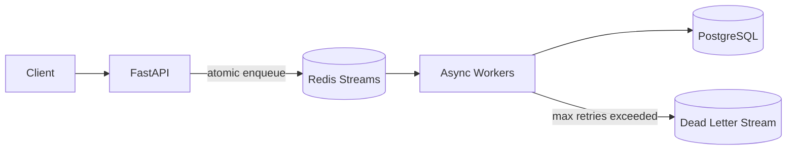

# high-throughput-event-platform

A production-oriented backend portfolio project for **high-volume event ingestion and asynchronous processing** using FastAPI, PostgreSQL, Redis Streams, and Docker.

The project demonstrates the backend concerns that matter beyond CRUD: burst handling, idempotency, at-least-once processing, database-side deduplication, retries, a dead-letter queue, rate limiting, health checks, metrics, load testing, and an AWS-ready production design.

## Why this project exists

Many event-driven products receive traffic faster than downstream storage or analytics systems can safely process it. Writing every event synchronously to a database couples client latency to database health and makes traffic spikes harder to absorb.

This project separates **ingestion** from **processing**:



## Features

- FastAPI event ingestion API
- single-event and batch ingestion (`1..1000` events/request)
- Redis Streams consumer groups
- atomic Redis Lua-based enqueue + idempotency key
- PostgreSQL primary-key deduplication as the final consistency boundary
- asynchronous worker processing
- stale pending-message recovery with Redis `XAUTOCLAIM`
- retry and dead-letter queue handling
- Redis-backed fixed-window rate limiting
- user-level aggregate profiles
- basic analytics endpoint
- Prometheus-compatible metrics
- liveness and dependency-aware readiness checks
- Docker Compose local environment
- load/benchmark scripts
- AWS reference architecture
- GitHub Actions CI

## Tech stack

**Python 3.12 · FastAPI · SQLAlchemy 2 · asyncpg · PostgreSQL 16 · Redis 7 · Pydantic 2 · Docker · Prometheus**

## Quick start

### 1. Configure

```bash
cp .env.example .env
```

### 2. Start the stack

```bash
docker compose up --build
```

Services:

- API: `http://localhost:8000`
- Swagger: `http://localhost:8000/docs`
- Metrics: `http://localhost:8000/metrics`
- PostgreSQL: `localhost:5432`
- Redis: `localhost:6379`

### 3. Send an event

```bash
curl -X POST http://localhost:8000/v1/events \
  -H 'Content-Type: application/json' \
  -d '{
    "event_id": "evt_demo_001",
    "user_id": "user_123",
    "event_type": "purchase",
    "timestamp": "2026-10-02T12:35:14Z",
    "properties": {
      "product_id": "SKU-3812",
      "amount": 89000,
      "currency": "KRW"
    }
  }'
```

Expected response:

```json
{
  "event_id": "evt_demo_001",
  "accepted": true,
  "status": "queued",
  "request_id": null
}
```

Send the exact same `event_id` again and `accepted` becomes `false`, demonstrating ingestion idempotency.

## API

| Method | Endpoint | Purpose |
|---|---|---|
| `POST` | `/v1/events` | enqueue one event |
| `POST` | `/v1/events/batch` | enqueue up to 1,000 events |
| `GET` | `/v1/users/{user_id}` | read aggregate user profile |
| `GET` | `/v1/analytics/summary?hours=24` | basic event analytics |
| `GET` | `/health/live` | process liveness |
| `GET` | `/health/ready` | PostgreSQL + Redis readiness |
| `GET` | `/metrics` | Prometheus metrics |

## Event model

```json
{
  "event_id": "evt_01JXYZ123",
  "user_id": "user_1024",
  "event_type": "product_view",
  "timestamp": "2026-10-02T12:35:14Z",
  "properties": {
    "product_id": "SKU-3812",
    "source": "web"
  }
}
```

`properties` is intentionally schemaless JSONB so different event types can evolve without requiring a table migration for every event attribute.

## Idempotency strategy

The platform uses two boundaries:

1. **Redis ingestion boundary** — a Lua script atomically checks/sets `idempotency:{event_id}` and appends to the Redis Stream. This avoids a race where an idempotency key could be written without the queue message.
2. **PostgreSQL persistence boundary** — `event_id` is the primary key and inserts use `ON CONFLICT DO NOTHING`. Re-delivery by the queue therefore cannot produce duplicate database effects.

This lets the queue use at-least-once delivery while the application achieves effectively-once database effects for each event id.

## Retry and DLQ

A worker acknowledges a queue entry only after database processing succeeds. Transient failures are requeued with an incremented retry count. After `WORKER_MAX_RETRIES`, the message is written to `events-dlq`. Invalid payloads go straight to DLQ because retrying cannot make them valid. Workers also reclaim stale pending entries from crashed consumers with `XAUTOCLAIM`, preventing permanently stranded messages.

```text
process -> failure -> retry 1 -> retry 2 -> retry 3 -> DLQ
```

## User aggregation

Successful processing updates `user_profiles` with:

- total event count
- purchase count
- lifetime purchase amount
- last seen timestamp (monotonic even when events arrive out of order)

The update uses a PostgreSQL upsert so the event insert and aggregate update remain in one transaction.

## Load generation

Generate realistic synthetic traffic:

```bash
python scripts/generate_events.py --count 10000 --batch-size 100
```

Run a concurrent benchmark:

```bash
python scripts/benchmark.py --events 10000 --concurrency 100 --batch-size 100
```

The script reports throughput, mean latency, p50, p95, p99, and request failures. See [`docs/benchmarks.md`](docs/benchmarks.md).

> No fabricated benchmark results are committed. Run the tests on the target environment and record the actual numbers.

## Reliability decisions

### Why Redis Streams instead of writing directly to PostgreSQL?

The queue absorbs burst traffic and separates ingestion latency from downstream processing latency. Workers can scale independently, and database slowdowns do not immediately turn every client request into a slow request.

### Why Redis *and* PostgreSQL idempotency?

Redis avoids unnecessary duplicate queue traffic during a bounded window. PostgreSQL remains the durable source of truth because Redis keys can expire or be lost.

### Why return HTTP 202?

The API confirms that an event was accepted for asynchronous processing, not that all downstream side effects have completed.

### Why a DLQ?

Repeatedly failing messages should not block the hot path forever. DLQ entries preserve enough context for investigation and later replay.

## Database model

### `events`

- `event_id` primary key
- `user_id`
- `event_type`
- `occurred_at`
- `received_at`
- `properties` JSONB

Indexes are optimized for user timeline and event-type/time-window queries. See [`docs/architecture.md`](docs/architecture.md).

### `user_profiles`

A compact aggregate used to demonstrate transactional downstream processing without requiring a separate analytics system.

## AWS-ready architecture

A production deployment can map the local components to:

```text
FastAPI          -> ECS/Fargate
PostgreSQL       -> RDS PostgreSQL / Aurora
Redis            -> ElastiCache
Redis Streams    -> SQS or MSK
Docker images    -> ECR
Metrics/logging  -> CloudWatch / managed observability stack
Secrets          -> Secrets Manager
```

See [`docs/aws-architecture.md`](docs/aws-architecture.md) for the scaling and reliability model.

## Test

```bash
pytest -q
ruff check .
```

The unit tests cover schema validation, ingestion idempotency behavior, and retry/DLQ routing.

## Repository structure

```text
app/
  api/              HTTP routes
  core/             configuration, DB, Redis, metrics
  models/           SQLAlchemy models
  schemas/          Pydantic API/event contracts
  services/         ingestion, processing, rate limiting
  workers/          Redis Streams worker
scripts/             synthetic traffic + benchmark clients
tests/               unit tests
docs/                architecture and benchmark notes
```

## Next production steps

The current repository intentionally keeps infrastructure reproducible and understandable for a portfolio project. A real production rollout would add:

- Alembic migrations instead of startup-time table creation
- OpenTelemetry distributed tracing
- queue-lag alerts and DLQ replay tooling
- Terraform/CDK
- partitioning or an analytical store for very large historical event volumes
- authentication/authorization for tenant-aware multi-tenant ingestion

## Portfolio talking points

This project is designed to support concrete backend interview discussion:

- Why decouple ingestion from processing?
- How do you implement idempotency without losing messages?
- What does at-least-once delivery imply for database design?
- How do retries differ from a DLQ?
- How would you scale API tasks and workers independently?
- Where does PostgreSQL stop being the right analytical store?
- How would the local design map to AWS managed services?

These trade-offs are documented rather than hidden behind framework boilerplate.

## License

MIT
