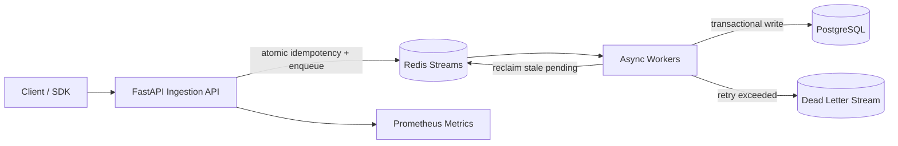

<div align="center">

# High-Throughput Event Platform

**Full-stack event platform: React/TypeScript operations console + FastAPI async backend**

React · TypeScript · FastAPI · PostgreSQL · Redis Streams · Docker · Prometheus

[](https://github.com/seoyeonglee/high-throughput-event-platform/actions/workflows/ci.yml)

</div>

---

## Why this project exists

This project is designed as an **end-to-end full-stack system**, not just an API demo.

The browser UI sends real events to a FastAPI ingestion service, the backend validates and enqueues them in Redis Streams, asynchronous workers process them, PostgreSQL stores durable event/user state, and the UI reads analytics and processed events back through REST APIs.

That means the project demonstrates the complete application path:

```text
React / TypeScript UI
        ↓
FastAPI REST API
        ↓
Redis Streams
        ↓
Async worker
        ↓
PostgreSQL
        ↓
Analytics / recent-event APIs
        ↓
React dashboard
```

## Full-stack capabilities demonstrated

### Frontend
- React + TypeScript + Vite
- responsive operations dashboard
- form handling and client-side validation
- asynchronous REST API integration
- dashboard metrics and event distribution visualization
- user aggregate lookup
- recent processed-event table
- error/loading/empty states

### Backend
- FastAPI asynchronous REST endpoints
- Pydantic validation
- PostgreSQL + async SQLAlchemy
- Redis Streams consumer groups
- idempotent ingestion
- retries / DLQ / worker crash recovery
- batch ingestion
- rate limiting
- Prometheus metrics
- health/readiness probes

### Engineering / delivery
- Docker Compose runs frontend, API, worker, PostgreSQL and Redis together
- GitHub Actions validates Python lint/tests and frontend production build
- synthetic traffic generator and benchmark tooling
- explicit reliability trade-offs and production mapping

## Recruiter-friendly demo flow

1. Start the full stack with Docker Compose.
2. Open the React console at `http://localhost:5173`.
3. Create a `product_view`, `add_to_cart`, or `purchase` event.
4. FastAPI returns HTTP 202 after queue acceptance.
5. A Redis Streams worker processes the event asynchronously.
6. PostgreSQL stores the event and updates the user aggregate.
7. Refresh the dashboard to see analytics, user state, and recent events.

## Tech stack

| Layer | Technology |
|---|---|
| Frontend | React 18, TypeScript, Vite, CSS |
| API | Python 3.12, FastAPI, Pydantic |
| Database | PostgreSQL 16, SQLAlchemy 2, asyncpg |
| Queue / cache | Redis 7, Redis Streams |
| Processing | Async Python workers, consumer groups |
| Observability | Prometheus, health/readiness probes |
| Runtime | Docker, Docker Compose |
| Quality | pytest, Ruff, TypeScript build, GitHub Actions |

## Quick start — full stack

```bash
cp .env.example .env
docker compose up --build
```

Open:

- Frontend: `http://localhost:5173`
- API docs: `http://localhost:8000/docs`
- Metrics: `http://localhost:8000/metrics`

---

## Architecture



### Processing flow

```text
Client
  │
  ▼
FastAPI validation
  │
  ▼
Atomic Redis Lua script
(idempotency key + XADD)
  │
  ▼
Redis Stream
  │
  ▼
Consumer Group Worker
  │
  ├── success ──► PostgreSQL ──► ACK
  │
  └── failure ──► Retry ──► Retry ──► DLQ
```

## Engineering highlights

### 1. Atomic ingestion idempotency

A Redis Lua script performs the idempotency check and stream append as one atomic operation. This avoids the failure mode where an idempotency key is written but the corresponding queue message is never created.

### 2. Two-layer duplicate protection

Redis prevents duplicate work during the ingestion window, while PostgreSQL enforces durable deduplication with `event_id` as the primary key and `ON CONFLICT DO NOTHING`.

**Queue semantics:** at-least-once  
**Database effect:** effectively once per event id

### 3. Worker crash recovery

Workers acknowledge messages only after successful database processing. If a worker dies before ACK, the message remains pending and another worker can reclaim it with Redis `XAUTOCLAIM`.

### 4. Failure isolation

Transient failures are retried with an incremented retry count. Messages that exceed the retry limit move to a DLQ. Invalid payloads go directly to the DLQ because retrying cannot make malformed data valid.

### 5. Independent scaling

API capacity and processing capacity are decoupled. In production, API containers can scale on request latency while workers scale on queue depth or oldest-message age.

## Tech stack

| Layer | Technology |
|---|---|
| API | Python 3.12, FastAPI, Pydantic 2 |
| Persistence | PostgreSQL 16, SQLAlchemy 2, asyncpg |
| Queue / cache | Redis 7, Redis Streams |
| Processing | Async Python workers, consumer groups |
| Observability | Prometheus metrics, health probes |
| Runtime | Docker, Docker Compose |
| Quality | pytest, Ruff, GitHub Actions |
| Cloud design | AWS ECS/Fargate, RDS, ElastiCache, SQS/MSK, ECR, CloudWatch |

## What this project demonstrates

- designing for burst traffic instead of assuming steady request volume;
- reasoning about **at-least-once delivery** and idempotent consumers;
- choosing the durable consistency boundary between Redis and PostgreSQL;
- recovering work after process failure rather than silently losing it;
- separating API latency from downstream database latency;
- measuring throughput and tail latency instead of claiming unverified performance;
- mapping a local architecture to managed production infrastructure.

> **Benchmark note:** the repository includes reproducible 10K/100K event benchmark tooling and reports throughput, mean latency, p50, p95, p99, and failures. No fabricated performance numbers are committed.

---

## Quick start

### 1. Configure

```bash
cp .env.example .env
```

### 2. Start the stack

```bash
docker compose up --build
```

Services:

- API: `http://localhost:8000`
- Swagger: `http://localhost:8000/docs`
- Metrics: `http://localhost:8000/metrics`
- PostgreSQL: `localhost:5432`
- Redis: `localhost:6379`

### 3. Send an event

```bash
curl -X POST http://localhost:8000/v1/events \
  -H 'Content-Type: application/json' \
  -d '{
    "event_id": "evt_demo_001",
    "user_id": "user_123",
    "event_type": "purchase",
    "timestamp": "2026-10-02T12:35:14Z",
    "properties": {
      "product_id": "SKU-3812",
      "amount": 89000,
      "currency": "KRW"
    }
  }'
```

Expected response:

```json
{
  "event_id": "evt_demo_001",
  "accepted": true,
  "status": "queued",
  "request_id": null
}
```

Send the exact same `event_id` again and `accepted` becomes `false`, demonstrating ingestion idempotency.

## API

| Method | Endpoint | Purpose |
|---|---|---|
| `POST` | `/v1/events` | enqueue one event |
| `POST` | `/v1/events/batch` | enqueue up to 1,000 events |
| `GET` | `/v1/users/{user_id}` | read aggregate user profile |
| `GET` | `/v1/analytics/summary?hours=24` | basic event analytics |
| `GET` | `/health/live` | process liveness |
| `GET` | `/health/ready` | PostgreSQL + Redis readiness |
| `GET` | `/metrics` | Prometheus metrics |

## Event model

```json
{
  "event_id": "evt_01JXYZ123",
  "user_id": "user_1024",
  "event_type": "product_view",
  "timestamp": "2026-10-02T12:35:14Z",
  "properties": {
    "product_id": "SKU-3812",
    "source": "web"
  }
}
```

`properties` is intentionally schemaless JSONB so different event types can evolve without requiring a table migration for every event attribute.

## Idempotency strategy

The platform uses two boundaries:

1. **Redis ingestion boundary** — a Lua script atomically checks/sets `idempotency:{event_id}` and appends to the Redis Stream. This avoids a race where an idempotency key could be written without the queue message.
2. **PostgreSQL persistence boundary** — `event_id` is the primary key and inserts use `ON CONFLICT DO NOTHING`. Re-delivery by the queue therefore cannot produce duplicate database effects.

This lets the queue use at-least-once delivery while the application achieves effectively-once database effects for each event id.

## Retry and DLQ

A worker acknowledges a queue entry only after database processing succeeds. Transient failures are requeued with an incremented retry count. After `WORKER_MAX_RETRIES`, the message is written to `events-dlq`. Invalid payloads go straight to DLQ because retrying cannot make them valid. Workers also reclaim stale pending entries from crashed consumers with `XAUTOCLAIM`, preventing permanently stranded messages.

```text
process -> failure -> retry 1 -> retry 2 -> retry 3 -> DLQ
```

## User aggregation

Successful processing updates `user_profiles` with:

- total event count
- purchase count
- lifetime purchase amount
- last seen timestamp (monotonic even when events arrive out of order)

The update uses a PostgreSQL upsert so the event insert and aggregate update remain in one transaction.

## Load generation

Generate realistic synthetic traffic:

```bash
python scripts/generate_events.py --count 10000 --batch-size 100
```

Run a concurrent benchmark:

```bash
python scripts/benchmark.py --events 10000 --concurrency 100 --batch-size 100
```

The script reports throughput, mean latency, p50, p95, p99, and request failures. See [`docs/benchmarks.md`](docs/benchmarks.md).

> No fabricated benchmark results are committed. Run the tests on the target environment and record the actual numbers.

## Reliability decisions

### Why Redis Streams instead of writing directly to PostgreSQL?

The queue absorbs burst traffic and separates ingestion latency from downstream processing latency. Workers can scale independently, and database slowdowns do not immediately turn every client request into a slow request.

### Why Redis *and* PostgreSQL idempotency?

Redis avoids unnecessary duplicate queue traffic during a bounded window. PostgreSQL remains the durable source of truth because Redis keys can expire or be lost.

### Why return HTTP 202?

The API confirms that an event was accepted for asynchronous processing, not that all downstream side effects have completed.

### Why a DLQ?

Repeatedly failing messages should not block the hot path forever. DLQ entries preserve enough context for investigation and later replay.

## Database model

### `events`

- `event_id` primary key
- `user_id`
- `event_type`
- `occurred_at`
- `received_at`
- `properties` JSONB

Indexes are optimized for user timeline and event-type/time-window queries. See [`docs/architecture.md`](docs/architecture.md).

### `user_profiles`

A compact aggregate used to demonstrate transactional downstream processing without requiring a separate analytics system.

## AWS-ready architecture

A production deployment can map the local components to:

```text
FastAPI          -> ECS/Fargate
PostgreSQL       -> RDS PostgreSQL / Aurora
Redis            -> ElastiCache
Redis Streams    -> SQS or MSK
Docker images    -> ECR
Metrics/logging  -> CloudWatch / managed observability stack
Secrets          -> Secrets Manager
```

See [`docs/aws-architecture.md`](docs/aws-architecture.md) for the scaling and reliability model.

## Test

```bash
pytest -q
ruff check .
```

The unit tests cover schema validation, ingestion idempotency behavior, and retry/DLQ routing.

## Repository structure

```text
app/
  api/              HTTP routes
  core/             configuration, DB, Redis, metrics
  models/           SQLAlchemy models
  schemas/          Pydantic API/event contracts
  services/         ingestion, processing, rate limiting
  workers/          Redis Streams worker
scripts/             synthetic traffic + benchmark clients
tests/               unit tests
docs/                architecture and benchmark notes
```

## Next production steps

The current repository intentionally keeps infrastructure reproducible and understandable for a portfolio project. A real production rollout would add:

- Alembic migrations instead of startup-time table creation
- OpenTelemetry distributed tracing
- queue-lag alerts and DLQ replay tooling
- Terraform/CDK
- partitioning or an analytical store for very large historical event volumes
- authentication/authorization for tenant-aware multi-tenant ingestion

## Portfolio talking points

This project is designed to support concrete backend interview discussion:

- Why decouple ingestion from processing?
- How do you implement idempotency without losing messages?
- What does at-least-once delivery imply for database design?
- How do retries differ from a DLQ?
- How would you scale API tasks and workers independently?
- Where does PostgreSQL stop being the right analytical store?
- How would the local design map to AWS managed services?

These trade-offs are documented rather than hidden behind framework boilerplate.

## License

MIT
