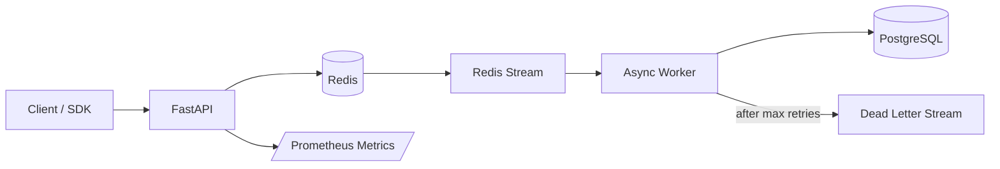

# Architecture

## Goals

The platform is designed around five backend concerns that commonly appear in event-driven systems:

1. absorb burst traffic without coupling API latency to downstream database work;
2. make event submission idempotent;
3. provide at-least-once processing while preventing duplicate database effects;
4. isolate transient failures with retry and dead-letter handling;
5. make behavior observable through metrics and health checks.

## Local architecture

## Ingestion path

`POST /v1/events` and `POST /v1/events/batch` validate events with Pydantic. A small Lua script performs the idempotency check and Redis Stream append atomically. This prevents the failure mode where an idempotency key is written but the event is never queued.

The API returns HTTP 202 because persistence and profile aggregation occur asynchronously.

## Processing semantics

Redis Streams consumer groups provide at-least-once delivery. Database idempotency is enforced again with a PostgreSQL primary key on `event_id`, so replaying a message does not apply the same event twice.

Workers periodically use `XAUTOCLAIM` to recover stale pending messages left behind by a worker process that died before acknowledging them.

A worker:

1. validates the queued payload;
2. inserts the event using `ON CONFLICT DO NOTHING`;
3. updates a per-user aggregate profile;
4. acknowledges the Redis message only after the database transaction succeeds.

## Failure handling

Transient failures are requeued with an incremented retry count. After `WORKER_MAX_RETRIES`, the payload is appended to the DLQ stream with the final error and original message id. Malformed payloads are sent directly to DLQ because retrying cannot repair invalid data.

## Database indexes

- `event_id` is the primary key and final idempotency boundary.
- `(user_id, occurred_at)` supports user timeline queries.
- `(event_type, occurred_at)` supports time-window analytics by event type.
- single-column indexes on `user_id` and `event_type` are included for common filtering paths.

For much larger volumes, the `events` table would be time-partitioned and older data moved to an analytical store such as ClickHouse, BigQuery, or Redshift.

## Backpressure

The Redis Stream decouples request acceptance from processing speed. If workers slow down, the queue grows while the API remains responsive. Operationally, queue lag should be monitored and worker replicas scaled before memory pressure becomes a risk.
