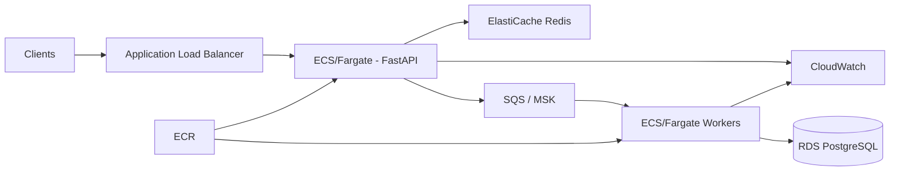

# AWS Production Architecture

The repository runs locally with Docker Compose, but the components map cleanly onto managed AWS services.

## Suggested production mapping

| Local component | AWS service | Rationale |
|---|---|---|
| FastAPI container | ECS on Fargate | simple horizontal autoscaling without managing nodes |
| PostgreSQL | RDS PostgreSQL / Aurora | managed backups, failover, metrics |
| Redis | ElastiCache for Redis | managed cache and rate-limit/idempotency store |
| Redis Stream queue | SQS for standard workloads, MSK for very high sustained throughput | durable managed messaging |
| Docker images | ECR | native ECS integration |
| Logs and alarms | CloudWatch | centralized logs, alarms, dashboards |
| Secrets | Secrets Manager | rotate DB/API credentials outside images |

## Scaling model

- API tasks scale on CPU, request count, or p95 latency.
- Worker tasks scale on queue depth / age of oldest message.
- RDS read replicas can serve analytics-style reads as load increases.
- SQS is preferred when ordering is not required; FIFO or Kafka/MSK can be introduced when ordering guarantees become a domain requirement.

## Reliability improvements for a real production deployment

- Multi-AZ RDS and ElastiCache;
- autoscaling policies for API and workers;
- WAF in front of the ALB;
- structured logs with trace IDs;
- OpenTelemetry tracing;
- versioned database migrations with Alembic;
- Terraform or CDK for reproducible infrastructure;
- DLQ alarms and replay tooling.
